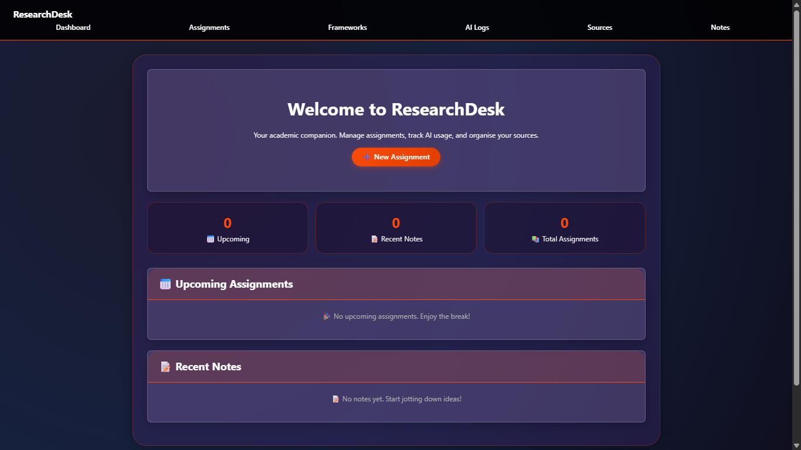
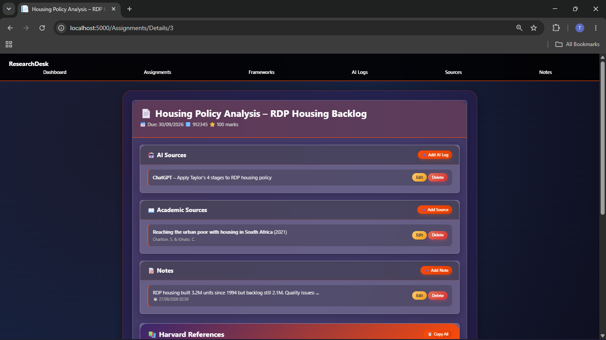
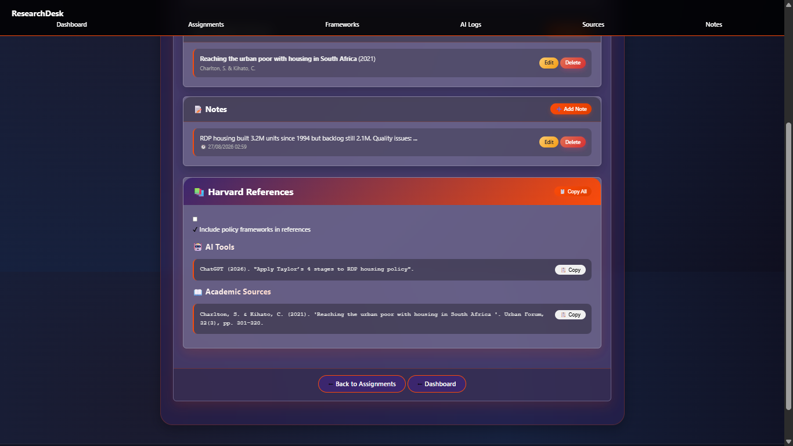
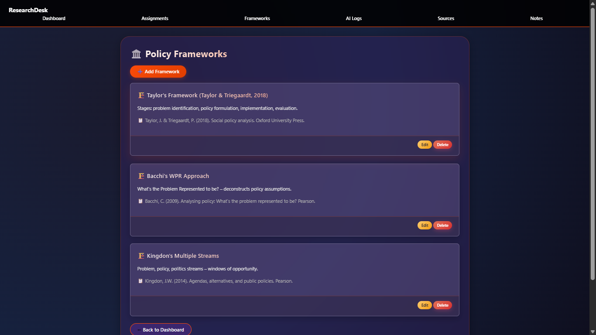

# 📚 ResearchDesk — Academic Research Management Web App

**A full-stack web application for managing academic research, assignments, sources, and references — built for real users.**



---

## 🚀 Live Demo

🔗 **This app runs 100% offline** — no internet required after download.  


---

## 📋 About The Project

ResearchDesk is a comprehensive academic management tool designed to help students and researchers organise their work. It allows users to:

- 📝 Manage assignments and projects
- 📚 Track academic sources (books, journals, articles)
- 🤖 Log AI interactions and prompts
- 📓 Keep research notes and frameworks
- 📄 Auto-generate Harvard-style references

**Built for a real user** — my sister is using this for her UNISA honours research. I built it from scratch, tested it with a non-technical user, and iterated based on feedback.

---

## 🛠️ Tech Stack

| Layer | Technology |
|-------|------------|
| **Backend** | C# / .NET 9 |
| **Framework** | ASP.NET Core MVC |
| **ORM** | Entity Framework Core |
| **Database** | SQLite |
| **Frontend** | Bootstrap 5, HTML, CSS, JavaScript |
| **UI Theme** | Glassmorphism — Phoenix Suns colours (#3B266E / #FA4B0A) |

---

## ✨ Key Features

### 📄 Harvard Reference Auto-Generator
Automatically generates Harvard-style citations for:
- Books
- Journal articles
- Government documents
- Website sources

### 🤖 AI Usage Logging
Track every AI interaction:
- Tool name (ChatGPT, DeepSeek, etc.)
- Question asked
- AI response
- Date used

### 📝 Notes & Sources
- Full CRUD operations across 5+ entities
- Notes linked to assignments
- Academic sources with publication details
- Context-aware navigation (`returnUrl`)

### 🏛️ Frameworks Library
Reusable policy/theory frameworks:
- Bacchi's WPR Approach
- Kingdon's Multiple Streams
- Taylor's Framework
- Add your own!

### 📱 Fully Responsive
Works on desktop, tablet, and mobile — custom glassmorphism UI.

### 💾 100% Offline
Runs entirely locally. No internet connection required.

---

## 📸 Screenshots

| Dashboard | Assignment Detail |
|-----------|-------------------|
|  |  |

| Harvard References | Frameworks |
|--------------------|------------|
|  |  |

---

## 📦 Offline Version (For Non-Technical Users)

If you just want to **use** the app without setting up a development environment:

1. **Download the `publish` folder** from this repository
2. Open the folder and double-click **`Start ResearchDesk.bat`**
3. A black window will open — **keep it open**
4. Your browser will open automatically to `http://localhost:5000`

**To close:** Close the browser, then close the black window.

> ⚠️ If Windows shows "Windows protected your PC", click **"More info"** → **"Run anyway"**

---

## 🏃‍♂️ For Developers — Getting Started

### Prerequisites
- [.NET 9 SDK](https://dotnet.microsoft.com/download)
- [Visual Studio 2022](https://visualstudio.microsoft.com/) or VS Code

### Installation

1. Clone the repository
git clone https://github.com/Thato-Root82/ResearchDesk.git

2. Navigate to the project directory
cd ResearchDesk

3. Restore dependencies
dotnet restore

4. Apply database migrations
dotnet ef database update

5. Run the application
dotnet run

6. Open your browser and go to https://localhost:5001

## 🚀 How to Build the Standalone App

1. Install the .NET 9 SDK from [https://dotnet.microsoft.com/](https://dotnet.microsoft.com/)
2. Open a terminal in the project folder (`ResearchDesk`)
3. Run:

   ```bash
   dotnet publish -c Release -r win-x64 --self-contained true -o ./publish
   ```

4. The standalone `.exe` will be in the `publish` folder. Run `ResearchDesk.exe` to start the app.
---

## 📁 Project Structure

ResearchDesk/
├── Controllers/          # MVC Controllers
│   ├── AssignmentsController.cs
│   ├── NotesController.cs
│   ├── AISourcesController.cs
│   ├── AcademicSourcesController.cs
│   ├── FrameworksController.cs
│   └── DashboardController.cs
├── Models/               # Entity models + DbContext
│   ├── Assignment.cs
│   ├── Note.cs
│   ├── AISource.cs
│   ├── AcademicSource.cs
│   ├── Framework.cs
│   └── ResearchDeskDbContext.cs
├── Views/                # Razor views
├── wwwroot/              # Static files (CSS, JS)
└── Program.cs            # Application entry point

---

## 🔮 Future Improvements

- [ ] Export references to Word/PDF
- [ ] User authentication with roles
- [ ] Cloud deployment (Azure)
- [ ] API endpoints for mobile integration
- [ ] Dark mode toggle

---

## 🙋‍♂️ About The Developer

**Thato Mofokeng** — IT Graduate (NQF6) from Central University of Technology, Free State.

- 🔗 GitHub: https://github.com/Thato-Root82
- 🔗 LinkedIn: https://linkedin.com/in/tk-mofokeng
- 📧 thatomofokeng3008@gmail.com

---

## 📄 License

This project is open source and available under the MIT License.

---

